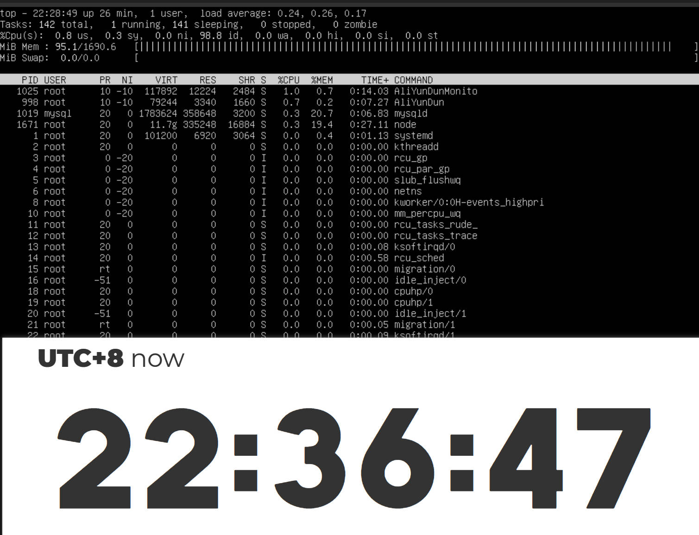
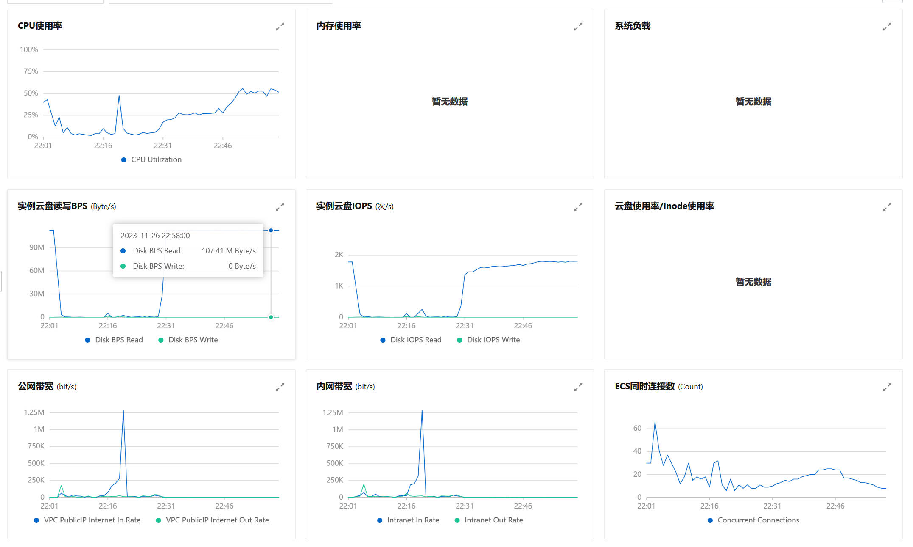

## 问题

今天刚在阿里云买了个北京的 ECS，因为是用来跑一个甲方的简单的小程序所以配置并不高。切换到了 Ubantu 系统后就开始配置环境。

开始都挺顺利的，安装并且运行了 webman, MySQL, Nginx。

但是在用 VSCode 连接并且安装了几个插件的时候，系统就卡死了，SSH 连接不上，重启都花了接近 10 分钟。

在用 `top` 命令查看 CPU 占用率的时候，发现 CPU 占用率并不高，但是内存占用率却很高，同时发现 Swap 也没有启用。

## 状态




硬盘一直在读写，但是 CPU 占用率并不高，内存占用率很高（没安装插件的情况下，没有监控内存使用情况，这个是 top 信息从推测出来的），Swap 没有启用。

## 解决

第一次出现的时候，我发起了重启的请求，过了 10 分钟才完成，但是重启之后还是一样的情况。
- 顺便吐槽一下，阿里云的这个普通重启，进入了停止中状态后，就不能再操作了，只能等着。
- 所以如果没什么重要的数据，可以直接强制重启，这样会快很多。

第二次出现的时候，我就开始查找解决方案，发现了一个很简单的方法，就是开启 Swap。


```bash
# 创建一个 4G 的 Swap
sudo dd if=/dev/zero of=/swapfile bs=1M count=4096
# 格式化为 Swap
sudo mkswap /swapfile
# 启用 Swap
sudo swapon /swapfile
# 查看 Swap
free -m
```

## 总结

一般的 Linux 镜像都会默认开启 Swap，不清楚为什么阿里云的 ECS 的 Ubantu 镜像默认没有开启 Swap。

## 参考

- [Ubuntu实例中添加swap分区的方法](https://help.aliyun.com/zh/ecs/ubuntu-instance-to-add-the-swap-partition-method)
- [Linux不设交换分区可能卡死系统]https://zhuanlan.zhihu.com/p/77460236