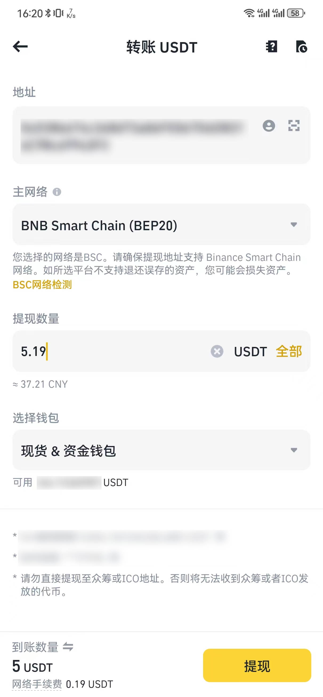

# TL;DR

总耗时约 2 小时，花费约 $2 梯子 + $2 注册 + $5 开卡 + $1 卡费 + $20 订阅 ~= 30 刀，成功升级 ChatGPT Plus，使用的是虚拟货币 + 虚拟信用卡的方式。

1. 准备虚拟货币
2. 准备虚拟信用卡
3. 付款
4. 完成

如果你没有虚拟货币账号，耗时至少 1 天（等待币安到账冷却时间）。如果你没有相关经验，耗时可能会更长。

# Backgourd

自从今年 2 月份开始，我就已经开始注册使用 [ChatGPT](https://chat.openai.com) 了，但一直都是使用的免费的 GPT-3 或者 3.5。

考虑到自己有这方面的需求，所以还是准备升级到 Plus 来使用 GPT-4 来帮助进行一些文字上的推理总结，在十一月份我就加入了 GPT 的 waitlist，在今天早上六点收到了 OpenAI 的邮件，提示排队排到了，可以付钱了。

碰巧在前几天，校园网也支持了访问 ChatGPT，所以就决定今天来升级。


# 梯子

这里就不展开介绍了，使用 ChatGPT 要求使用**非香港**的节点，不了解的可以问问身边的同学。大概的开销是 10 元左右。

这里提示一点就是，如果你使用的小猫没有选择 “切换节点时自动断开连接” 那么尽管你选择了其他国家或地区的节点，之前的 TCP 连接可能还没有断开，连接的仍然是的之前的节点，需要重启小猫才可以成功切换。

# 账号注册

这里就不多赘述了，我是今年二月份跟着网上的教程注册的，最开始使用的是 Gmail，但是可能因为 IP 不干净，所以导致 Gmail 被的账号被封了；后面用 QQ 邮箱发现也可以成功注册。

因为 OpenAI 的限制，注册后需要使用海外的手机号验证，当时使用的网站是 [sms-activate.org](https://sms-activate.org/?ref=3468662)，找了个 +44 开头的手机号就成功注册了。最初这个网站是没有充值下限的，写文章时最低充值是 2 美元，手续费 0.03$ + 3%，算下来大概是 15 元人民币。 

# 升级

首先就是加入 OpenAI 的 waitlist，这个是需要等待的，我是十一月份加入的，今天早上六点收到了邮件，提示可以付钱了。在 [ChatGPT](https://chat.openai.com/) 左下角升级就 ok 了。

ChatGPT 的升级页面使用的是 Stripe 的支付服务，虽然标上了支持银联，但是实际测试时，还是会提示**不支持**。所以这里使用的方法是 **虚拟货币 + 虚拟信用卡** 支付。

## 准备虚拟货币

虚拟货币有很多交易平台，我这里使用的是 [币安](https://www.binance.com/zh-CN/activity/referral-entry/CPA?ref=CPA_00D0U30ERZ)，为了防止洗钱，很多交易平台都需要实名认证 `KYC` (Know Your Customer)，这里只需要如实提供信息并完成人脸认证就可以了。


KYC 审核需要一段时间，几小时到几天内就会通过，通过后就可以充值了。

这里的充值其实是购买虚拟货币，目标种类选择 USDT 也就是锚定美元的虚拟货币，右上角选择 CNY 也就是人民币，然后可以筛选需要的支付方式，有支付宝、微信、银行卡。

因为和你交易的其实是国内同样在使用这个平台的人，**所以这个风险是需要自己承担的**。当然平台也有一些保障，例如风控系统之类的，当然我们可以选择**单数比较多**，**成单率比较高**的商户来进行交易。为了避免洗钱，有的商户会要求提供银行流水或者其他证明材料，这个就看自己的衡量了。

**这里再提一嘴，没必要的需求，最好别把虚拟货币里的资金提到银行卡里，否则这样可能会被银行冻结。**

我这没有使用币安的交易，而是直接收的别人转来的 USDT，所以这里就不展开了。

## 准备虚拟信用卡

这里使用的是 [Dupay](https://dupay.one/web-app/register-h5?invitCode=Ffo4ep&lang=zh-cn)，这个网站是提供虚拟信用卡的，注册后充值 USDT，然后就可以申请虚拟信用卡。

### 风险提示

在网上可以看到很多人说这个网站是**诈骗**，大额的资金可能会被吞，建议大家用多少充值多少，不要存太多资金在里面。（也不要每次都用的一点都不剩，这样可能会导致风控冻结账户）

另外这个站点看上去是国人商家在运营，还是留个心眼吧。

### 充值

注册后就可以进行充值，选择钱包，充币，选择 USDT，然后主网选择 BEP20，这个主网充值速度比较快，手续费也还好是大概 2 元人民币左右。

然后就可以打开币安，选择资金，现货账户，选择 USDT，然后点击提币，选择区块链转账，输入 Dupay 的 USDT 地址，然后选择 BEP20，这里的 提现数量 = 到账数量 + 网络手续费，在交易时，一般是由支付方承担网络手续费，收款方一般只提供到账数量，这里注意不要弄错了。

点击提现之后，再次确认地址，网络，数量正确，因为如果填写错误，资金就找不回来了。

充值之后等待 5 分钟左右，就可以在 Dupay 上看到充值的 USDT 了。



### 开卡

```
亲爱的Dupay用户：

我们非常高兴地宣布，从11月22日起，Dupay将推出一款全新的订阅卡，专为订阅各类服务而设计。此订阅卡的特点和费用如下所示：
-开卡费：5 USDT
-月费：1 USD
-卡片资金上限：500USD
-卡片有效期：2年
-卡片类型：Visa预付卡
-支持场景：支持Twitter、ChatGPT、OPENAI、AppStore美区、Google play美区等订阅场景（不支持支付宝、微信、美团等国内支付）
-注意事项：此订阅卡卡片资金上限为500USD，消费低于500USD后可继续充值。

我们期待您能够充分利用这项新服务，以更加便捷和高效的方式管理您的订阅。感谢您对Dupay的持续支持！

Dupay Teams
2023/11/22
```

这里选择订阅卡即可，开卡费最低，实测可以支持 ChatGPT 的订阅。


### 兑换

在 dupay 的钱包里选择实时兑换，将 USDT 兑换成美元，兑换的美元可以充值进卡片，然后就可以使用了。

### 付款

这一步是最关键的一步了，本人按照下面的方法成功支付了。

1. 梯子选择美国全局的节点，这里的 IP 一定要干净，不要是很多人使用的，不然可能会被拒绝支付
2. 打开浏览器的无痕模式
3. 打开 ChatGPT 的升级页面，选择支付转跳到 stripe
4. 填写卡号，有效期，CVV。这里有效期格式是 MM/YY，今年申请的卡有效期到 2025/12，所以填写的是 12/25，CVV 是三位数字，可以在 dupay 的首页找到
5. 持卡人姓名，这里填写的是自己的名字，就是注册 dupay 时填写的名字，填写大写的英文
6. 下一步需要填写地址，这一步需要填写美国的地址，否则可能会提示“您的银行卡被拒绝了”。首先查看 IP 属地: [https://ipinfo.io/](https://ipinfo.io/)，然后将 IP abuse 中的 address 丢到 [Google Map](https://www.google.com/maps) 中搜索，然后挑一个路边的点击一下，就可以看到地址了，然后将地址填写到 stripe 中就 ok 了。

### 完成

付款成功后，会收到 OpenAI 的邮件，提示升级成功，然后就可以在 ChatGPT 中使用了。之后每月的同一天会自动扣款，如果不想继续使用，可以在 ChatGPT 中取消订阅。如果多次余额不足导致扣款失败，可能会导致 dupay 的卡被冻结，需要联系客服解冻。

