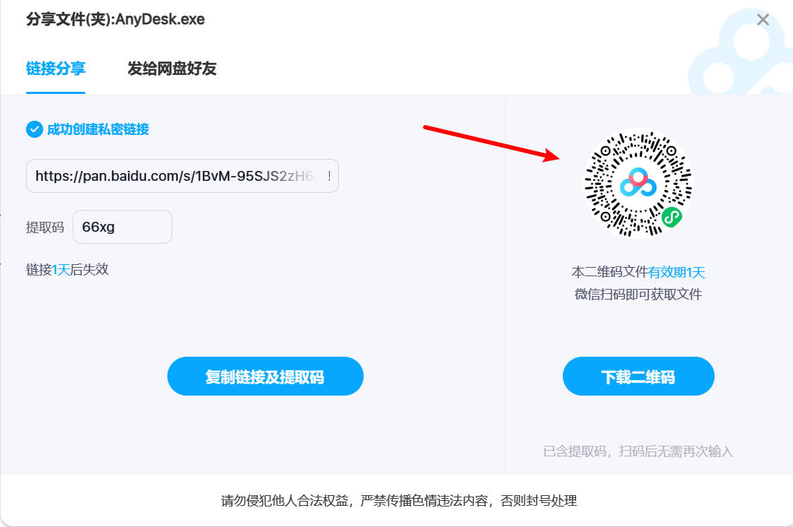
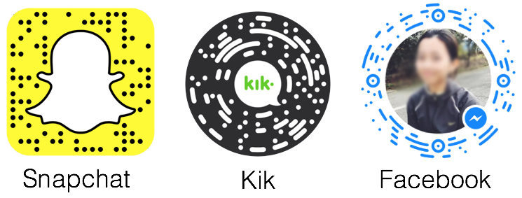

## 问题
百度网盘在进行分享的时候，会同时生成一个微信小程序码，有时候会在生活中碰到这种二维码，而想要获取其对应的分享链接和提取码就得想点办法。



## 微信小程序码

现在见到的各种各样的微信小程序码，其实并不是标准的 QR Code，都是微信私有的异形码。

也就是说除了微信之外，无法用其他的工具来生成或者解析。

其实不只微信，有很多国外的公司都有自己的异形码标准，比如 Snapchat 的 [Snapcode](https://help.snapchat.com/hc/en-us/articles/7012342798612-What-is-a-Snapcode-)，Facebook 的 Messenger Code 等等。



在网上找了一圈，发现微信在 2017 年的时候就已经上线了 [微信小程序码](https://mp.weixin.qq.com/s?__biz=MzA3NDEyMDgzMw==&mid=2652945109&idx=1&sn=1470784ce041e80e312a9427fcbdecc1)。

然后找到了一篇介绍技术的文章：[【小程序码设计篇】菊花绽放](https://cloud.tencent.com/developer/article/1005027)。

总的来说就是图个辨识度，同时有一定的安全性，因为所有的码都必须由微信生成，所以在一定程度上可以防止二维码被篡改、伪造。

## 分享链接

在 [这篇知乎专栏](https://zhuanlan.zhihu.com/p/584852445) 中，作者介绍了通过举报的方式来获取分享链接和提取码，但是操作比较麻烦，首先需要登录，其次还要使用电脑端微信。

其实测试之后，发现在扫码之后，直接点击右上角 `...` 按钮，然后选择 `反馈与举报`，这时候会进入微信内置的浏览器，然后在右上角点击  `...` 中的 `复制链接`，就可以看到如下内容：

```text
https://mp.weixin.qq.com/wxawap/wapreportwxadevlog?action=complain_feedback&appid=wxdcd3d073e47d1742&embeddedappid=&hostappid=&pageid=pages%2Fnetdisk_share%2Fshare.html%3Fscene%3D1****%2523n09j%25230%25230&from=3&version_type=0&version_code=***&screenshot_localId=weixin%3A%2F%2Fresourceid%2F0a5b259ed0d93fbfe17cc91179e7****&sessionid=hash=54987****&ts=1701281612610&host=&version=67109****&device=2&business_appid=&msgid=&public_lib_version=1108&public_lib_version_str=3.2.3&template_id=#wechat_redirect
```

稍微观察一下，我们可以发现相关的参数有：

- `appid=wxdcd3d073e47d1742`：微信小程序的 AppID
- `pageid=pages%2Fnetdisk_share%2Fshare.html%3Fscene%3D1****%2523n09j%25230%25230`：分享的页面路径
- `screenshot_localId=weixin%3A%2F%2Fresourceid%2F0a5b259ed0d93fbfe17cc91179e7****`：截图的本地 ID，可能和举报的时候上传的截图有关
- `sessionid=hash=54987****`：会话 ID
- `ts=1701281612610`：时间戳
- `version=671099709`：微信版本

其中路径是我们关心的，很明显，这是一个 URL 编码过的路径，解码之后就是：

```text
pageid=pages/netdisk_share/share.html?scene=1****%23n09j%230%230
```

发现还有编码的 `%23`，再次解码之后就是：

```text
pageid=pages/netdisk_share/share.html?scene=1****#n09j#0#0
```

很明显，这就是微信小程序中分享的页面路径，scene 是场景值

这个场景值的组成是：

```text
scene=<surl>#<pwd>#0#0
```

其中 `<surl>` 是分享链接（shorturl的缩写），`<pwd>` 是提取码，后面两个 0 可能和分享的时候选择的分享方式有关，或者就是预留的参数，这里就不深究了。

将 scene 还原成标准的分享链接之后就是：

```text
https://pan.baidu.com/s/<surl>?pwd=<pwd>

https://pan.baidu.com/s/1****?pwd=n09j
```

访问之后就可以看到分享的文件了。

## 结尾

最开始我想到的办法其实是用 Charles 来抓包，在 Windows 上抓包就可以看到分享链接和提取码了，但是终究不是很方便。

所以在想着能不能做个小工具直接上传截图，然后自动解析出分享链接和提取码，但是看起来微信的小程序码并不是很容易就能解析出来。就算解析出来，也不一定可以直接获取到 scene 的值，所以这个想法就暂时搁置了。

目前最方便的方法就是直接在微信中举报，然后复制链接，然后截取出分享链接和提取码。

这里顺便贴一个 regex，可以用来从举报链接中提取出分享链接和提取码：

```text
/scene%3D([A-Za-z0-9-_]+)%2523([\w\d]{4})%2523/gm
```

## 参考

- [【小程序码设计篇】菊花绽放](https://cloud.tencent.com/developer/article/1005027)
- [扫码背后藏了什么秘密？小程序码又为何长得像菊花？ | 你问鹅答](https://mp.weixin.qq.com/s?__biz=MzA3NDEyMDgzMw==&mid=2652945109&idx=1&sn=1470784ce041e80e312a9427fcbdecc1)
- [What is a Snapcode?](https://help.snapchat.com/hc/en-us/articles/7012342798612-What-is-a-Snapcode-)
- [打开链接发现要提取码怎么办？更新来了（总结前人经验）](https://zhuanlan.zhihu.com/p/584852445)
- [regex101](https://regex101.com/)
- [你一定不知道，小程序码是这样绽放的](https://cdc.tencent.com/2017/09/01/%E4%BD%A0%E4%B8%80%E5%AE%9A%E4%B8%8D%E7%9F%A5%E9%81%93%EF%BC%8C%E5%B0%8F%E7%A8%8B%E5%BA%8F%E7%A0%81%E6%98%AF%E8%BF%99%E6%A0%B7%E7%BB%BD%E6%94%BE%E7%9A%84/)